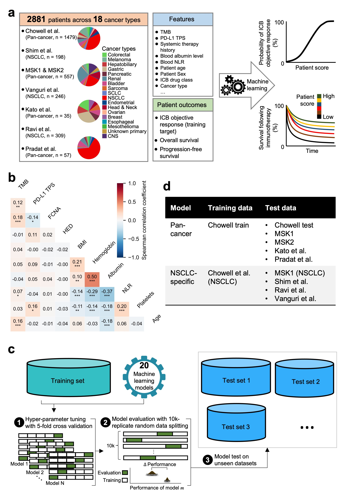
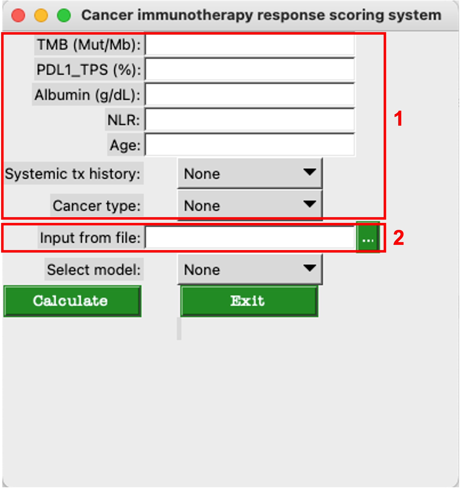

## LORIS: A Cancer Immunotherapy Response Scoring System


LORIS is a powerful tool for predicting patient objective ICB (Immune Checkpoint Blockade) response odds and survival following ICB treatment based on common clinical, pathologic, and genomic features. It offers a user-friendly graphic user interface (GUI) for ease of use.


<p align="center">
  
</p>

Figure 1. Development of the LOgistic Regression-based Immunotherapy-response Score (LORIS).


### License
LORIS source code is provided under the [GPLv3 license](LICENSE). Additionally, the trained models used by LORIS, located in this package at `LORIS/model_Params`, are provided under the [CC BY NC 4.0](LICENSE) license for academic and non-commercial use.

### Installation
LORIS can be installed from the [github repository](https://github.com/rootchang/LORIS_GUI.git):

```sh
git clone https://github.com/rootchang/LORIS_GUI.git
cd LORIS_GUI
python setup.py install
```

### Usage
Run LORIS from the command line with the following command:

```sh
LORIS
```

This will launch the GUI for further interaction (see Figure 2).

<p align="center">
  
</p>

Figure 2. GUI of LORIS.

### Examples
#### Example 1: Inquiry for a Single Patient

1. Input the required clinical features (e.g., TMB, albumin, NLR, and age) of the patient in the GUI (highlighted as red box 1 in Figure 2).

2. Select the desired model (e.g., `LLR6_pan-cancer` or `LLR6_NSCLC`).

3. Click the `Calculate` button.

4. Obtain the predicted ICB outcome of the patient, including:

	(i) Patient score (0-1) with a 95% confidence interval.
	
	(ii) Objective response odds (%) with a 95% confidence interval.
	
	(iii) Median progression-free survival (months) with a 95% confidence interval.
	
	(iv) Median overall survival (months) with a 95% confidence interval.

#### Example 2: Inquiry for Multiple Patients

1. Store the necessary clinical features of patients in a .txt file (highlighted as red box 2 in Figure 2; refer to the template file at `./LORIS/query_patients.txt` for the format).

2. Load the file from the GUI.

3. Select the model (e.g., `LLR6_pan-cancer` or `LLR6_NSCLC`).

4. Click the `Calculate` button.

5. Retrieve the predicted ICB outcomes from the output file, which is named `inputFilePrefix+"_out.txt"`.


### Citation
If you use LORIS in your research or work, please consider citing our publication:

Tian-Gen Chang, Yingying Cao, Hannah J. Sfreddo, Saugato Rahman Dhruba, Se-Hoon Lee, Cristina Valero, Seong-Keun Yoo, Diego Chowell, Luc G. T. Morris, Eytan Ruppin. "Robust prediction of patient outcomes with immune checkpoint blockade therapy for cancer using common clinical, pathologic, and genomic features." bioRxiv 2023.07.04.547697; doi: https://doi.org/10.1101/2023.07.04.547697

### Contact
For any questions or inquiries, please feel free to contact Tiangen Chang at changtiangen@gmail.com.